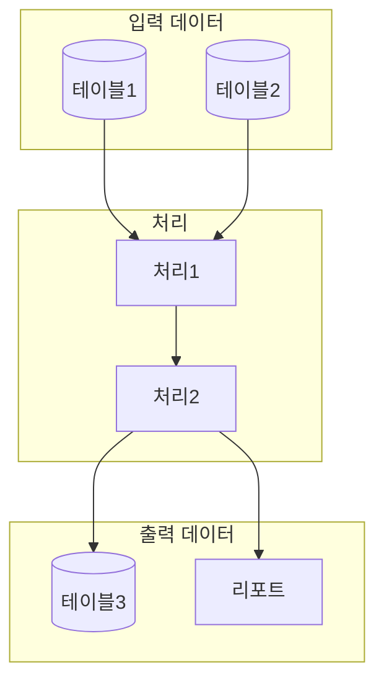
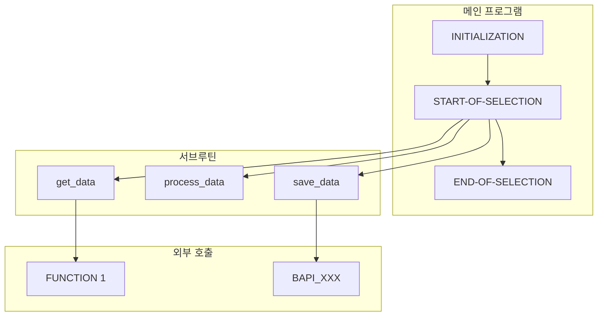

# ABAP 역공학 및 스펙 산출 (Reverse Engineering & Specification)

## 개요

이 스킬은 SAP ABAP 코드를 체계적으로 분석하여 문서화되지 않은 레거시 시스템의 비즈니스 로직과 기술 구조를 파악하고, 6가지 핵심 산출물을 생성합니다.

## 분석 대상 ABAP 유형

| 유형 | 식별 패턴 | 주요 분석 포인트 |
|------|----------|-----------------|
| Report Program | `REPORT`, `WRITE`, `SELECTION-SCREEN` | 선택화면, 출력 로직, ALV |
| Module Pool | `PROGRAM`, `MODULE`, `CALL SCREEN` | Dynpro 흐름, PAI/PBO |
| Function Module | `FUNCTION`, `ENDFUNCTION` | Import/Export/Tables/Changing 파라미터 |
| Function Group | `FUNCTION-POOL` | 전역 데이터, 포함 프로그램 |
| Class/Interface | `CLASS`, `INTERFACE`, `METHOD` | 상속, 다형성, 이벤트 |
| BADI/Enhancement | `GET BADI`, `CALL BADI`, `ENHANCEMENT` | 확장 포인트, 필터 |
| BAPI | `BAPI_*` 네이밍, RFC 활성화 | 표준 인터페이스, 커밋 처리 |
| CDS View | `@AbapCatalog`, `DEFINE VIEW` | 연관관계, 어노테이션 |
| AMDP | `BY DATABASE PROCEDURE` | HANA SQL Script |

---

## 분석 프로세스 (6단계)

### Phase 1: 코드 구조 파악

```
1. 프로그램 타입 식별
2. INCLUDE 구조 매핑
3. 전역 변수/상수 목록화
4. 주요 서브루틴/메서드 식별
5. 외부 호출 (RFC, BAPI, HTTP) 파악
```

**식별 키워드:**
- `INCLUDE` → 포함 프로그램
- `TABLES:` → 사용 테이블 (구식)
- `DATA:`, `TYPES:` → 데이터 정의
- `CONSTANTS:` → 상수 정의
- `CLASS-DATA:` → 정적 속성

### Phase 2: 데이터 흐름 분석

```
1. SELECT 문 추출 및 테이블 관계 파악
2. Internal Table 사용 패턴 분석
3. 데이터 변환 로직 추적
4. INSERT/UPDATE/DELETE/MODIFY 식별
5. COMMIT WORK/ROLLBACK WORK 위치 파악
```

**핵심 패턴:**
```abap
" 읽기 패턴
SELECT ... FROM <table> INTO [TABLE] <target> WHERE ...
SELECT SINGLE ... 
LOOP AT ... WHERE ...

" 쓰기 패턴  
INSERT <table> FROM [TABLE] <source>
UPDATE <table> SET ... WHERE ...
MODIFY <table> FROM [TABLE] <source>
DELETE FROM <table> WHERE ...

" 트랜잭션 경계
COMMIT WORK [AND WAIT]
ROLLBACK WORK
CALL FUNCTION ... IN UPDATE TASK
```

### Phase 3: 비즈니스 로직 추출

```
1. 조건 분기 (IF/CASE) 로직 트리 구성
2. 계산식/수식 추출
3. 유효성 검증 규칙 식별
4. 예외 처리 패턴 분석
5. 메시지 (MESSAGE) 매핑
```

**분석 대상:**
```abap
" 조건 분기
IF <condition>.
CASE <variable>.
CHECK <condition>.

" 유효성 검증
IF <field> IS INITIAL.
IF <field> NOT IN <range>.
AUTHORITY-CHECK OBJECT ...

" 계산 로직
COMPUTE ...
<field> = <expression>.

" 메시지
MESSAGE <type><number>(<class>) WITH ...
RAISE EXCEPTION TYPE ...
```

### Phase 4: 인터페이스 분석

```
1. RFC/BAPI 호출 목록화
2. 파라미터 매핑 (Import/Export/Tables/Changing)
3. 동기/비동기 호출 구분
4. 에러 처리 패턴 분석
5. IDoc 구조 파악 (해당시)
```

**인터페이스 패턴:**
```abap
" RFC 호출
CALL FUNCTION '<name>' DESTINATION '<dest>'
  EXPORTING ...
  IMPORTING ...
  TABLES ...
  EXCEPTIONS ...

" BAPI 호출
CALL FUNCTION 'BAPI_*'
CALL FUNCTION 'BAPI_TRANSACTION_COMMIT'

" 비동기 호출
CALL FUNCTION ... STARTING NEW TASK
CALL FUNCTION ... IN BACKGROUND TASK
CALL FUNCTION ... IN UPDATE TASK
```

### Phase 5: 호출 관계 매핑

```
1. PERFORM → 서브루틴 호출
2. CALL METHOD → 메서드 호출
3. CALL FUNCTION → 펑션 모듈 호출
4. CALL SCREEN → 화면 호출
5. SUBMIT → 프로그램 호출
6. CALL TRANSACTION → 트랜잭션 호출
```

**호출 계층 시각화:**
```
Main Program
├── PERFORM sub1
│   ├── CALL FUNCTION 'FUNC1'
│   └── CALL METHOD obj->method1
├── CALL SCREEN 100
│   ├── MODULE pbo OUTPUT
│   └── MODULE pai INPUT
└── SUBMIT report2
```

### Phase 6: 산출물 생성

각 산출물은 별도 파일로 생성합니다.

---

## 산출물 템플릿

### 1. 비즈니스 로직 명세서 (Business Logic Specification)

```markdown
# 비즈니스 로직 명세서

## 1. 문서 정보
- 프로그램명: <program_name>
- 분석일자: <date>
- 버전: 1.0

## 2. 업무 개요
### 2.1 업무 목적
<프로그램의 비즈니스 목적 기술>

### 2.2 업무 흐름 요약
<전체 프로세스 흐름 다이어그램 또는 설명>

## 3. 상세 비즈니스 규칙

### 3.1 규칙 ID: BR-001
- **규칙명**: <규칙 이름>
- **설명**: <상세 설명>
- **조건**: <적용 조건>
- **처리**: <처리 내용>
- **예외**: <예외 상황>
- **관련 코드 위치**: <파일명:라인번호>

### 3.2 규칙 ID: BR-002
...

## 4. 계산식/수식

### 4.1 계산 ID: CALC-001
- **계산명**: <계산 이름>
- **수식**: <수식 표현>
- **입력값**: <입력 필드 목록>
- **출력값**: <결과 필드>
- **관련 코드**: <코드 스니펫>

## 5. 유효성 검증 규칙

| 검증 ID | 필드명 | 검증 내용 | 에러 메시지 | 코드 위치 |
|---------|--------|----------|------------|----------|
| VAL-001 | | | | |

## 6. 메시지 목록

| 메시지 번호 | 타입 | 텍스트 | 발생 조건 |
|------------|------|-------|----------|
| | | | |
```

### 2. 데이터 흐름도 (Data Flow Specification)

```markdown
# 데이터 흐름 명세서

## 1. 문서 정보
- 프로그램명: <program_name>
- 분석일자: <date>

## 2. 사용 테이블 목록

### 2.1 읽기 전용 테이블 (SELECT)
| 테이블명 | 설명 | 접근 유형 | 조건 필드 | 코드 위치 |
|---------|------|----------|----------|----------|
| | | SINGLE/MULTI | | |

### 2.2 쓰기 테이블 (INSERT/UPDATE/DELETE/MODIFY)
| 테이블명 | 설명 | 작업 유형 | 조건 | 코드 위치 |
|---------|------|----------|------|----------|
| | | | | |

## 3. Internal Table 사용

| 변수명 | 구조/타입 | 용도 | 주요 처리 |
|--------|----------|------|----------|
| | | | |

## 4. 데이터 흐름 다이어그램



## 5. 트랜잭션 경계

| 위치 | 유형 | 설명 |
|------|------|------|
| | COMMIT/ROLLBACK | |
```

### 3. 기능 명세서 (Functional Specification)

```markdown
# 기능 명세서

## 1. 문서 정보
- 프로그램명: <program_name>
- 프로그램 타입: REPORT/MODULE POOL/FUNCTION GROUP/CLASS
- 분석일자: <date>

## 2. 프로그램 개요
- **목적**: 
- **트랜잭션 코드**: 
- **패키지**: 
- **책임 영역**: 

## 3. 선택 화면 (Selection Screen)

### 3.1 파라미터
| 필드명 | 레이블 | 타입 | 필수여부 | 기본값 | 설명 |
|--------|-------|------|---------|-------|------|
| | | | | | |

### 3.2 Select-Options
| 필드명 | 레이블 | 참조 테이블/필드 | 설명 |
|--------|-------|-----------------|------|
| | | | |

## 4. 화면 목록 (Module Pool의 경우)

| 화면번호 | 화면명 | 용도 | 다음 화면 |
|---------|-------|------|----------|
| | | | |

## 5. 기능 목록

### 5.1 기능 ID: FUNC-001
- **기능명**: 
- **설명**: 
- **입력**: 
- **출력**: 
- **처리 단계**:
  1. 
  2. 
- **관련 서브루틴/메서드**: 

## 6. 이벤트 블록 (Report의 경우)

| 이벤트 | 처리 내용 |
|--------|----------|
| INITIALIZATION | |
| AT SELECTION-SCREEN | |
| START-OF-SELECTION | |
| END-OF-SELECTION | |

## 7. 권한 체크

| 권한 객체 | 필드 | 값 | 설명 |
|----------|------|---|------|
| | | | |
```

### 4. 인터페이스 명세서 (Interface Specification)

```markdown
# 인터페이스 명세서

## 1. 문서 정보
- 프로그램명: <program_name>
- 분석일자: <date>

## 2. 외부 호출 인터페이스

### 2.1 RFC/BAPI 호출

#### IF-001: <Function Module명>
- **호출 유형**: RFC / BAPI / LOCAL
- **대상 시스템**: <destination>
- **동기/비동기**: SYNC / ASYNC / UPDATE TASK

**Import 파라미터:**
| 파라미터명 | 타입 | 필수 | 설명 | 매핑 소스 |
|-----------|------|------|------|----------|
| | | | | |

**Export 파라미터:**
| 파라미터명 | 타입 | 설명 | 매핑 타겟 |
|-----------|------|------|----------|
| | | | |

**Tables 파라미터:**
| 파라미터명 | 구조 | 입출력 | 설명 |
|-----------|------|-------|------|
| | | | |

**예외 처리:**
| Exception | 처리 내용 |
|-----------|----------|
| | |

**코드 위치**: <파일:라인>

### 2.2 HTTP/REST 호출 (해당시)

| ID | URL/Endpoint | Method | 설명 |
|----|-------------|--------|------|
| | | | |

## 3. 내부 인터페이스 (Function Module 파라미터)

### 3.1 Import 파라미터
| 파라미터명 | 타입 | 참조 | 필수 | 기본값 | 설명 |
|-----------|------|------|------|-------|------|
| | | | | | |

### 3.2 Export 파라미터
| 파라미터명 | 타입 | 참조 | 설명 |
|-----------|------|------|------|
| | | | |

### 3.3 Changing 파라미터
| 파라미터명 | 타입 | 참조 | 설명 |
|-----------|------|------|------|
| | | | |

### 3.4 Tables 파라미터
| 파라미터명 | 구조 | 설명 |
|-----------|------|------|
| | | |

### 3.5 Exceptions
| Exception명 | 설명 | 발생 조건 |
|------------|------|----------|
| | | |

## 4. IDoc 인터페이스 (해당시)

| IDoc Type | Message Type | 방향 | 설명 |
|-----------|-------------|------|------|
| | | Inbound/Outbound | |
```

### 5. 테이블/구조 명세서 (Data Structure Specification)

```markdown
# 테이블/구조 명세서

## 1. 문서 정보
- 프로그램명: <program_name>
- 분석일자: <date>

## 2. 사용 데이터베이스 테이블

### 2.1 Transparent Tables

#### <테이블명>
- **설명**: 
- **패키지**: 
- **접근 방식**: READ / WRITE / BOTH

**주요 필드:**
| 필드명 | 타입 | 길이 | Key | 설명 |
|--------|------|------|-----|------|
| | | | ✓/- | |

**사용 위치:**
| 코드 위치 | 작업 유형 | 조건 |
|----------|----------|------|
| | SELECT/INSERT/UPDATE/DELETE | |

### 2.2 Cluster/Pool Tables (해당시)
...

## 3. 커스텀 구조 (Structure)

### <구조명>
- **정의 위치**: 프로그램 내 / DDIC
- **용도**: 

| 필드명 | 타입 | 길이 | 설명 |
|--------|------|------|------|
| | | | |

## 4. 커스텀 테이블 타입 (Table Type)

### <테이블타입명>
- **Line Type**: 
- **Key 유형**: STANDARD / SORTED / HASHED
- **Key 필드**: 

## 5. 전역 변수/상수

### 5.1 전역 변수
| 변수명 | 타입 | 초기값 | 용도 |
|--------|------|-------|------|
| | | | |

### 5.2 상수
| 상수명 | 타입 | 값 | 용도 |
|--------|------|---|------|
| | | | |

## 6. 도메인/데이터 엘리먼트 (해당시)

| 이름 | 유형 | 데이터타입 | 길이 | 설명 |
|-----|------|----------|------|------|
| | Domain/DE | | | |
```

### 6. 호출 관계도 (Call Hierarchy Specification)

```markdown
# 호출 관계도

## 1. 문서 정보
- 프로그램명: <program_name>
- 분석일자: <date>

## 2. 호출 계층 구조

```
<프로그램명>
├── [E] INITIALIZATION
│   └── PERFORM init_data
├── [E] AT SELECTION-SCREEN
│   └── PERFORM validate_input
├── [E] START-OF-SELECTION
│   ├── PERFORM get_data
│   │   ├── CALL FUNCTION 'FUNC1'
│   │   └── SELECT FROM table1
│   ├── PERFORM process_data
│   │   ├── CALL METHOD obj->method1
│   │   │   └── CALL METHOD obj->method2
│   │   └── PERFORM calc_amount
│   └── PERFORM save_data
│       ├── CALL FUNCTION 'BAPI_XXX'
│       └── COMMIT WORK
└── [E] END-OF-SELECTION
    └── PERFORM display_result
        └── CALL FUNCTION 'REUSE_ALV_GRID_DISPLAY'

[E] = Event Block
```

## 3. 상세 호출 목록

### 3.1 서브루틴 (PERFORM)

| 서브루틴명 | 호출 위치 | 파라미터 | 설명 |
|-----------|----------|---------|------|
| | | USING/CHANGING | |

### 3.2 메서드 (CALL METHOD)

| 클래스 | 메서드명 | 호출 위치 | 설명 |
|--------|---------|----------|------|
| | | | |

### 3.3 펑션 모듈 (CALL FUNCTION)

| 펑션명 | 호출 위치 | 유형 | 설명 |
|--------|----------|------|------|
| | | RFC/LOCAL | |

### 3.4 프로그램 호출 (SUBMIT)

| 프로그램명 | 호출 위치 | 옵션 | 설명 |
|-----------|----------|------|------|
| | | AND RETURN/VIA JOB | |

### 3.5 트랜잭션 호출 (CALL TRANSACTION)

| 트랜잭션 | 호출 위치 | 모드 | 설명 |
|---------|----------|------|------|
| | | N/A/E | |

### 3.6 화면 호출 (CALL SCREEN)

| 화면번호 | 호출 위치 | 옵션 | 설명 |
|---------|----------|------|------|
| | | STARTING AT | |

## 4. Mermaid 다이어그램



## 5. 의존성 매트릭스

| From \ To | sub1 | sub2 | sub3 | FUNC1 | BAPI |
|-----------|------|------|------|-------|------|
| MAIN | ✓ | ✓ | ✓ | | |
| sub1 | | | | ✓ | |
| sub2 | | | ✓ | | |
| sub3 | | | | | ✓ |
```

---

## 분석 수행 지침

### 1. 코드 수신 시
1. 코드 전체를 먼저 읽고 프로그램 타입 식별
2. 구조적 개요 파악 (INCLUDE, 전역변수, 주요 블록)
3. 사용자에게 분석 범위 확인 (전체 또는 특정 부분)

### 2. 분석 진행 시
1. 6단계 Phase를 순차적으로 수행
2. 각 Phase 완료 후 중간 결과 공유
3. 불명확한 부분은 가정을 명시하고 진행

### 3. 산출물 생성 시
1. 각 산출물은 별도 마크다운 파일로 생성
2. Mermaid 다이어그램 적극 활용
3. 코드 위치(파일:라인) 항상 명시
4. 한글 설명 우선, 기술 용어는 영문 병기

### 4. 품질 체크리스트
- [ ] 모든 SELECT 문이 데이터 흐름도에 포함되었는가?
- [ ] 모든 비즈니스 규칙이 명세화되었는가?
- [ ] 모든 외부 호출이 인터페이스 명세에 포함되었는가?
- [ ] 호출 관계가 빠짐없이 매핑되었는가?
- [ ] 트랜잭션 경계가 명확히 식별되었는가?

---

## 자주 발견되는 ABAP 패턴

### 1. ALV 리포트 패턴
```abap
CALL FUNCTION 'REUSE_ALV_GRID_DISPLAY'
" 또는
cl_salv_table=>factory( )
```

### 2. BAPI 호출 패턴
```abap
CALL FUNCTION 'BAPI_*'
  IMPORTING
    return = lt_return.
IF lt_return-type CA 'AE'.
  CALL FUNCTION 'BAPI_TRANSACTION_ROLLBACK'.
ELSE.
  CALL FUNCTION 'BAPI_TRANSACTION_COMMIT'.
ENDIF.
```

### 3. Batch Input 패턴
```abap
CALL FUNCTION 'BDC_OPEN_GROUP'
CALL FUNCTION 'BDC_INSERT'
CALL FUNCTION 'BDC_CLOSE_GROUP'
" 또는
CALL TRANSACTION <tcode> USING <bdc_table> MODE 'N'
```

### 4. Exception 처리 패턴
```abap
TRY.
    ...
  CATCH cx_root INTO lx_error.
    lv_msg = lx_error->get_text( ).
ENDTRY.
```

### 5. 권한 체크 패턴
```abap
AUTHORITY-CHECK OBJECT '<auth_object>'
  ID '<field1>' FIELD <value1>
  ID 'ACTVT' FIELD '03'.  " Display
IF sy-subrc <> 0.
  MESSAGE e001.
ENDIF.
```

---

## 출력 파일 구조

분석 완료 후 다음 파일들을 생성합니다:

```
<program_name>_analysis/
├── 01_business_logic_spec.md
├── 02_data_flow_spec.md
├── 03_functional_spec.md
├── 04_interface_spec.md
├── 05_table_structure_spec.md
├── 06_call_hierarchy.md
└── 00_analysis_summary.md
```

각 파일은 독립적으로 활용 가능하며, `00_분석_요약.md`에서 전체 개요와 각 문서 링크를 제공합니다.
